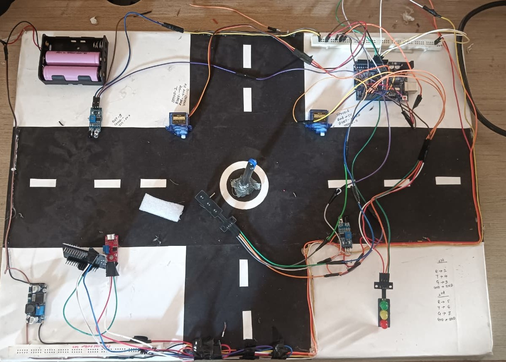
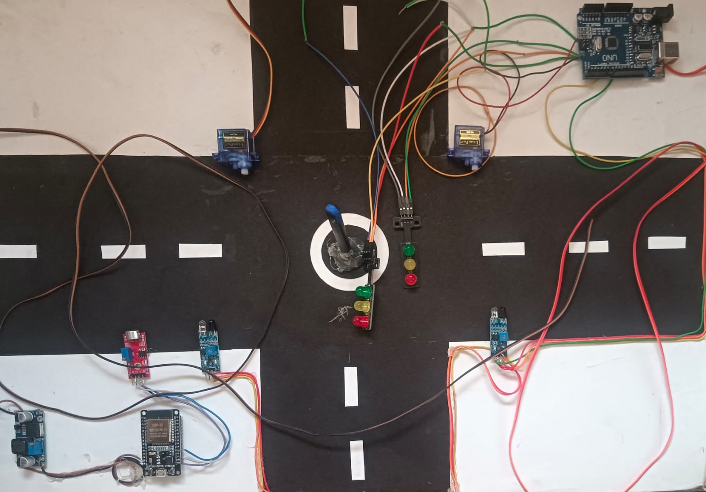
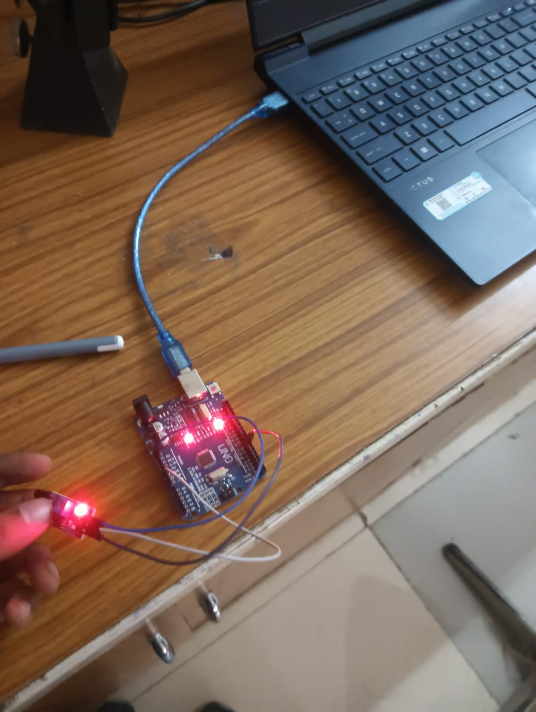
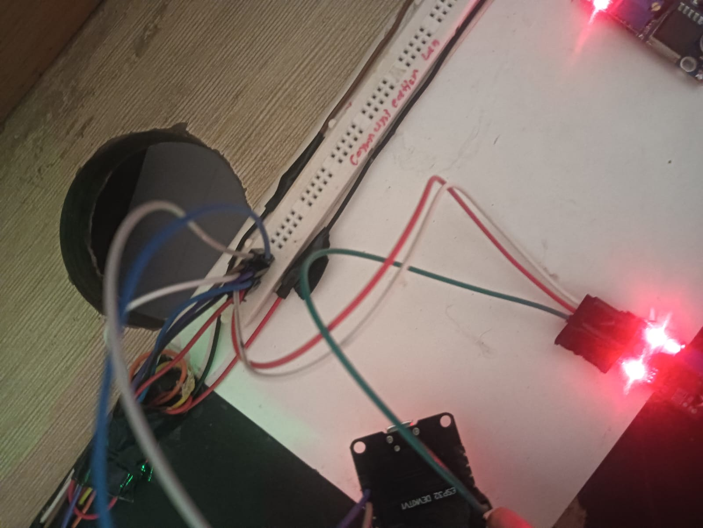
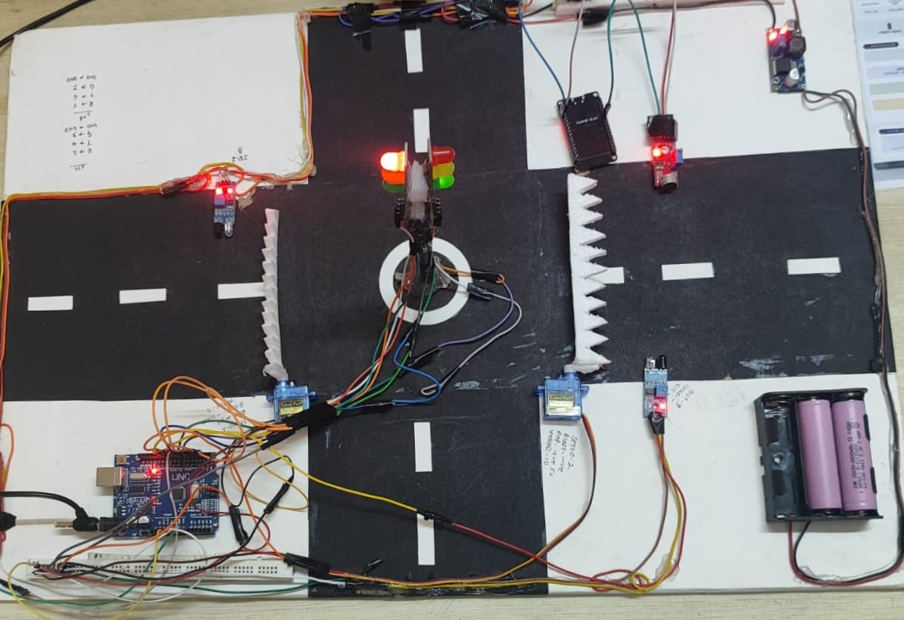
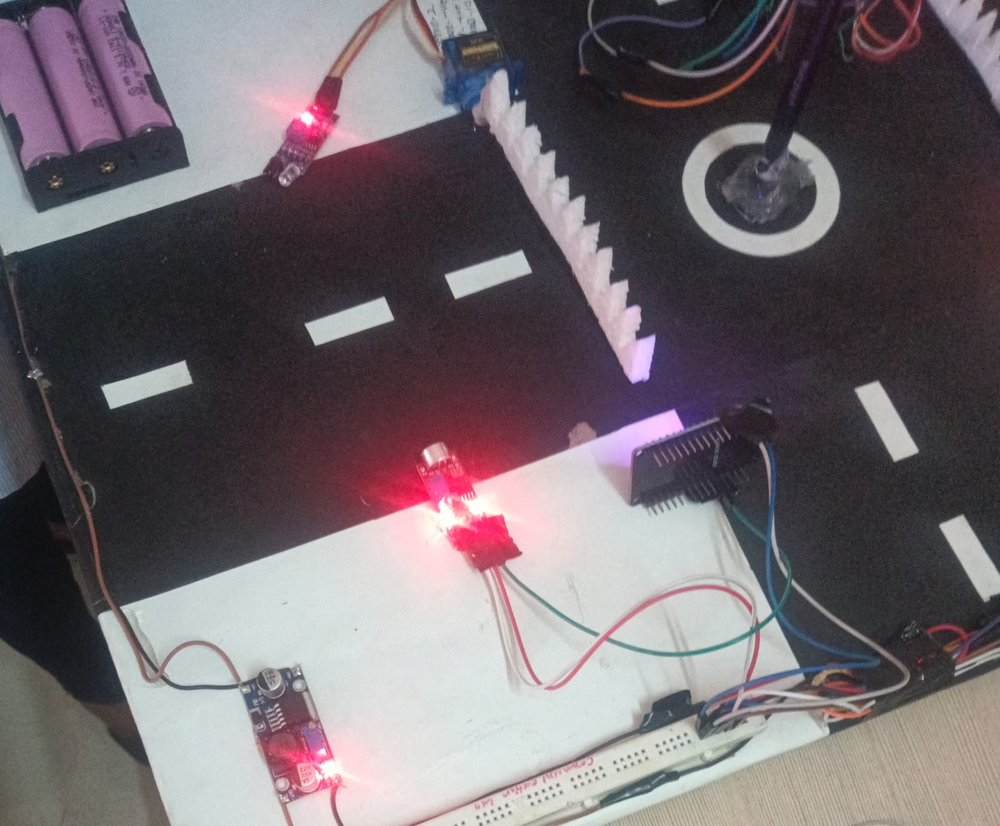

# 🚦 IoT-Based Traffic Control System

> An intelligent IoT-based traffic management system that dynamically controls traffic signals using real-time vehicle density, prioritizes emergency vehicles, operates a smart speed breaker, and enables remote monitoring through the Blynk IoT platform.

---

## 📖 Overview

Traffic congestion and delayed emergency response are major problems in modern cities. Traditional traffic signals operate on fixed timings and cannot adapt to real-time traffic conditions.

This project introduces an **IoT-Based Traffic Control System** that uses **ESP32**, **Arduino UNO**, **IR Sensors**, **Sound Sensors**, and **Servo Motors** to create an intelligent traffic management solution.

The system:
- Detects vehicle density using IR sensors
- Dynamically adjusts signal timing
- Detects ambulance sirens
- Gives emergency vehicles priority
- Controls an automatic smart speed breaker
- Allows remote monitoring through the Blynk IoT App

---

# ✨ Features

✅ Adaptive Traffic Signal Control

✅ Real-Time Vehicle Density Detection

✅ Emergency Vehicle Prioritization

✅ Smart Speed Breaker Automation

✅ ESP32 + Arduino Dual Controller Architecture

✅ Remote Monitoring using Blynk IoT

✅ Energy Efficient Design

✅ Low Cost Prototype

---

# 🛠 Hardware Components

| Component | Quantity |
|-----------|----------|
| ESP32 Development Board | 1 |
| Arduino UNO | 1 |
| IR Sensors | 4 |
| Sound Sensors | 2 |
| SG90 Servo Motors | 2 |
| Traffic Signal LEDs | 4 Sets |
| Buck Converter | 1 |
| Battery / Power Supply | 1 |

---

# 💻 Software & Technologies

- Arduino IDE
- ESP32 Arduino Core
- Blynk IoT Platform
- Embedded C++
- UART Communication
- Wi-Fi Connectivity

---

# ⚙ Working Principle

### Step 1

IR Sensors detect traffic density in each lane.

↓

### Step 2

ESP32 processes sensor data and calculates traffic density.

↓

### Step 3

Traffic signal timing is dynamically adjusted.

↓

### Step 4

Sound sensor continuously listens for ambulance sirens.

↓

### Step 5

If an ambulance is detected:

- Other lanes become RED
- Ambulance lane becomes GREEN
- Speed breaker lowers automatically

↓

### Step 6

Current system status is uploaded to the Blynk IoT dashboard.

---

# 🏗 System Architecture

```
             Blynk IoT App
                   │
               Wi-Fi Cloud
                   │
               ESP32 Controller
         ┌─────────┴──────────┐
         │                    │
   IR Sensors           Sound Sensors
         │                    │
         └─────────┬──────────┘
                   │
             Arduino UNO
          ┌────────┴────────┐
          │                 │
      Traffic LEDs     Servo Motors
                         │
                 Smart Speed Breaker
```

---

# 📊 Experimental Results

| Test | Result |
|-------|--------|
| Adaptive Signal Timing | ✔ Successful |
| Emergency Vehicle Detection | ✔ Successful |
| Dynamic Speed Breaker | ✔ Response < 0.5 sec |
| Remote Monitoring | ✔ Successful |
| Dual Core Operation | ✔ Stable |

---

# 🚀 Future Improvements

- AI-based Vehicle Detection using Camera
- License Plate Recognition
- Automatic Accident Detection
- Cloud Data Analytics
- GPS-based Ambulance Tracking
- Multiple Junction Synchronization
- Machine Learning Based Traffic Prediction

---

# 📷 Project Under Development

> Add your development images here.

```
project/
│
├── images/
│   ├── development1.jpg
│   ├── development2.jpg
│   ├── development3.jpg
│   └── development4.jpg
```

| Prototype Development | Circuit Assembly |
|----------------------|------------------|
|  |  |

| Wiring | Testing |
|---------|---------|
|  |  |

---

# 🎉 Final Project

> Add completed project images here.

```
project/
│
├── images/
│   ├── final1.jpg
│   ├── final2.jpg
│   ├── final3.jpg
│   └── final4.jpg
```

| Front View | Side View |
|------------|-----------|
|  |  |

| Working Demo | Blynk Dashboard |
|--------------|-----------------|
|  |  |

---

# 📂 Project Structure

```
IoT-Based-Traffic-Control-System/

│
├── Arduino_Code/
├── ESP32_Code/
├── Circuit_Diagram/
├── Images/
│
├── Report.pdf
├── README.md
└── LICENSE
```

---

# 👨‍💻 Team Members

- Janavi R. Sadmake
- Dhiraj P. Badre
- Saloni V. Chavhan
- Samiksha R. Bhagat
- Ritesh G. Burange
- Raman M. Gulhane
- Rutuja S. Avhad
---

# 🙏 Acknowledgements

We sincerely thank the Department of Electronics and Telecommunication Engineering and our project guide for their valuable guidance and continuous support throughout the development of this project.

---

# 📜 License

This project is developed for academic purposes.

---

⭐ If you found this project helpful, consider giving it a Star!
